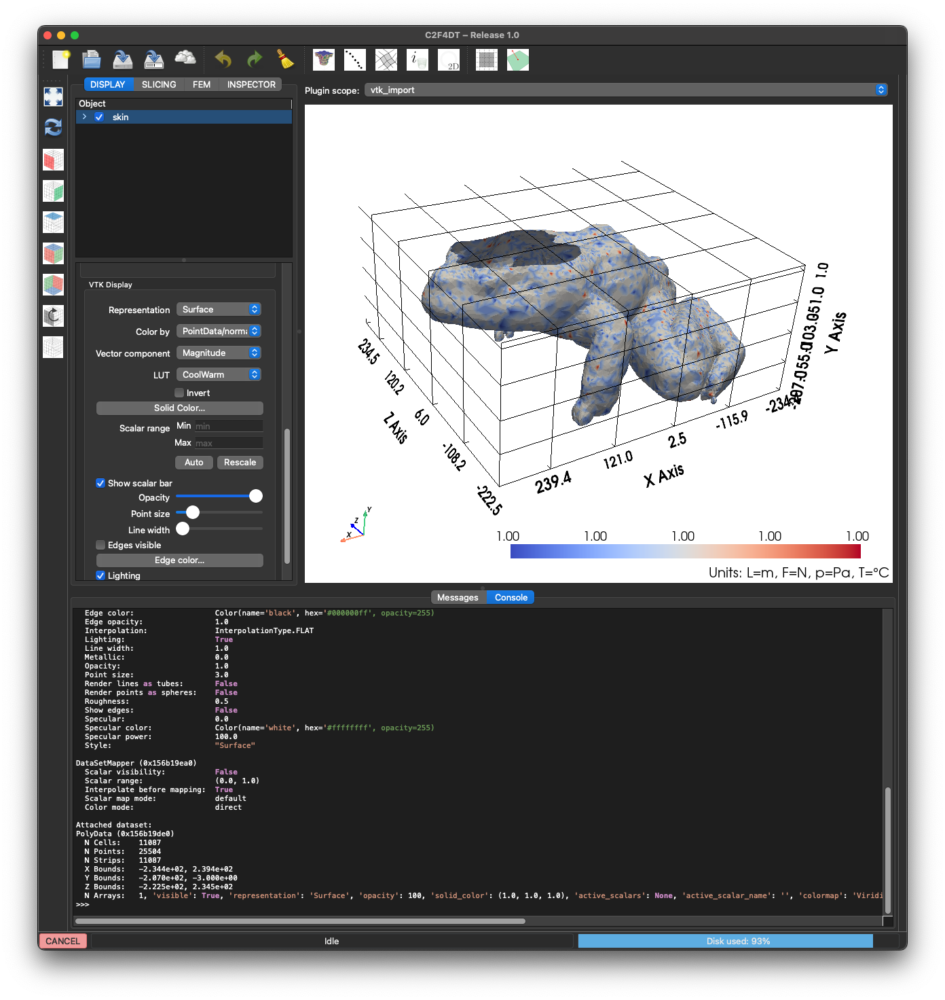

# C2F4DT Python Console — User Guide & Cheat Sheet




The C2F4DT console is a lightweight, Abaqus-style **interactive Python** terminal built into the UI. It lets you:
- Inspect objects in the current scene (viewer, datasets, treeMCTS).
- Query VTK/PyVista data (points, cells, arrays).
- Batch operations: styling, screenshots, exports.
- Run quick scripts with a persistent namespace.

> Tip: Press **TAB** for autocompletion. Use **Shift+Enter** to insert a newline without executing.

---

## Quick Start

1. Open **View → Console** (or the console tab/pane if pinned).
2. At the prompt `>>>` type Python code and press **Enter**.
3. Multi-line blocks are supported; continuation prompts use `...`.
4. Use **Up/Down** to navigate command history on the current prompt.

---

## Cheat Sheet (TL;DR)

```python
# Get common objects from the live context
window           # MainWindow instance
viewer = window.viewer3d
mct              # Current dataset record (dict)
mcts             # All dataset records (dict[str, dict])

# Current dataset index and record
ds = window._current_dataset_index()
rec = viewer._datasets[ds]

# Switch representation / color mode
viewer.set_mesh_representation(ds, "Surface with Edges")
viewer.set_color_mode("Solid Color", ds)
viewer.set_color_mode("PointData/displacement", ds)  # then choose vector mode in UI

# Change visuals
viewer.set_mesh_opacity(ds, 60)       # 0..100
viewer.set_point_size(5, ds)
viewer.set_line_width(ds, 2)
viewer.set_edge_visibility(ds, True)
viewer.set_edge_color(ds, 0, 0, 0)
viewer.set_scalar_bar_visible(ds, True)

# Fit camera & screenshot
viewer.view_fit()
viewer.save_screenshot("scene.png")

# File system magics
%pwd
%ls *.vtk
%cd path/to/data
%run my_script.py
%clear
```

---

## Keybindings

- **Enter**: Execute (if the code block is syntactically complete).
- **Shift+Enter**: Newline (do not execute).
- **TAB**: Autocomplete (popup with names/attributes/keys).
- **Up/Down**: Command history (at current prompt).
- **Home/Backspace**: Protected before prompt (can’t edit past output).

---

## Supported “Magics”

The console implements a few IPython-like “magics” (single-line commands):

- `%pwd` — print current working directory  
- `%cd <path>` — change directory (e.g., `%cd ../data`)  
- `%ls [pattern]` — list files (glob pattern, e.g., `%ls *.vtk`)  
- `%run <file.py>` — run a local Python file with access to `window/mct/mcts`  
- `%clear` — clear the console buffer

> Note: `%run` calls `window._exec_script_file()` under the hood, so your script can interact with the live app.

---

## The Live Context

Every time you execute, the console refreshes a persistent namespace that includes:

- `window`: the main UI/controller
- `viewer3d` (via `window.viewer3d`): the plotter & dataset actors
- `mct`: the **current** dataset’s metadata/visual state (dict)
- `mcts`: the collection of all dataset entries (dict)

This means you can write short, **stateful** snippets that build on previous ones.

---

## Practical Examples

### 1) Inspect the current scene

```python
# Inspect current dataset and its arrays
ds = window._current_dataset_index()
rec = window.viewer3d._datasets[ds]           # internal record

# Prefer the renderable surface (PolyData) for visualization
pdata = rec.get("mesh_surface") or rec.get("mesh") or rec.get("pdata") or rec.get("full_pdata")

print("Dataset keys:", list(rec.keys()))
print("n_points =", getattr(pdata, "n_points", None), " n_cells =", getattr(pdata, "n_cells", None))
print("PointData arrays:", list(getattr(pdata, "point_data", {}).keys()))
print("CellData arrays:",  list(getattr(pdata, "cell_data",  {}).keys()))
```

### 2) Extract a **PointData** vector magnitude to CSV

```python
import numpy as np
import csv

def export_point_magnitude(array_name: str, csv_path: str) -> None:
    # Export the vector magnitude of a PointData array to CSV
    ds = window._current_dataset_index()
    rec = window.viewer3d._datasets[ds]
    src = rec.get("mesh_orig") or rec.get("mesh") or rec.get("pdata") or rec.get("full_pdata")
    arr = np.asarray(src.point_data[array_name])
    if arr.ndim != 2 or arr.shape[1] not in (2, 3):
        raise ValueError(f"{array_name} is not a 2D vector array")
    mag = np.linalg.norm(arr, axis=1)

    with open(csv_path, "w", newline="") as f:
        w = csv.writer(f)
        w.writerow(["point_id", f"{array_name}_magnitude"])
        for i, v in enumerate(mag):
            w.writerow([i, float(v)])

export_point_magnitude("displacement", "displacement_mag.csv")
print("Saved: displacement_mag.csv")
```

### 3) Color the mesh by **displacement magnitude** from the console

```python
ds = window._current_dataset_index()
window.viewer3d.set_color_mode("PointData/displacement", ds)
mct["vector_mode"] = "Magnitude"
mct["colormap"] = "Viridis"
mct["invert_lut"] = False
window.viewer3d.set_scalar_bar_visible(ds, True)
window.viewer3d.view_render()
```

### 4) Batch toggle styles and take screenshots

```python
from pathlib import Path

def batch_screenshots(out_dir: str = "_shots") -> None:
    reps = ["Surface", "Surface with Edges", "Wireframe", "Points"]
    Path(out_dir).mkdir(exist_ok=True)
    ds = window._current_dataset_index()

    for r in reps:
        window.viewer3d.set_mesh_representation(ds, r)
        window.viewer3d.view_fit()
        path = str(Path(out_dir) / f"{r.replace(' ', '_')}.png")
        window.viewer3d.save_screenshot(path)
        print("[saved]", path)

batch_screenshots()
```

### 5) Extract **displacement X/Y/Z** to Pandas (optional)

```python
import numpy as np
import pandas as pd

def point_components_to_dataframe(array_name: str) -> "pd.DataFrame":
    ds = window._current_dataset_index()
    rec = window.viewer3d._datasets[ds]
    src = rec.get("mesh_orig") or rec.get("mesh") or rec.get("pdata") or rec.get("full_pdata")
    vec = np.asarray(src.point_data[array_name])
    if vec.ndim != 2 or vec.shape[1] not in (2, 3):
        raise ValueError("Not a vector array")
    cols = ["X", "Y"] if vec.shape[1] == 2 else ["X", "Y", "Z"]
    return pd.DataFrame(vec, columns=cols)

df = point_components_to_dataframe("displacement")
df.describe()
```

### 6) Programmatically edit appearance

```python
def set_pretty_style(ds: int) -> None:
    viewer = window.viewer3d
    viewer.set_mesh_representation(ds, "Surface with Edges")
    viewer.set_mesh_opacity(ds, 100)
    viewer.set_edge_visibility(ds, True)
    viewer.set_edge_color(ds, 0, 0, 0)
    viewer.set_point_size(3, ds)
    viewer.set_line_width(ds, 1)
    viewer.view_fit()
    viewer.view_render()

set_pretty_style(window._current_dataset_index())
```

---

## Data Mapping Notes

C2F4DT renders non-PolyData inputs (e.g., `UnstructuredGrid`) via an **extracted surface**. PointData arrays are mapped using:

1. `vtkOriginalPointIds`
2. KDTree nearest neighbor (if SciPy installed)
3. Pass-through if sizes match

---

## Troubleshooting

- **No colors / white mesh** → choose a valid array in “Color by”  
- **LUT not working** → install matplotlib (`pip install matplotlib`)  
- **Mapping fails** → install SciPy (`pip install scipy`)  

---

## Appendix: Minimal API Reference

- `window._current_dataset_index()`  
- `viewer3d.set_mesh_representation(ds, mode)`  
- `viewer3d.set_color_mode(mode, ds)`  
- `viewer3d.set_scalar_bar_visible(ds, on: bool)`  
- `viewer3d.set_mesh_opacity(ds, value: int)`  
- `viewer3d.set_point_size(value: int, ds)`  
- `viewer3d.set_line_width(ds, value: int)`  
- `viewer3d.set_edge_visibility(ds, on: bool)`  
- `viewer3d.set_edge_color(ds, r, g, b)`  
- `viewer3d.view_fit()`, `viewer3d.view_render()`, `viewer3d.save_screenshot(path)`

---

## Changelog & Credits

This guide corresponds to the version where:
- PointData → surface mapping was added (via `vtkOriginalPointIds` + KDTree fallback).
- LUT normalization and scalar array robustness were improved.
