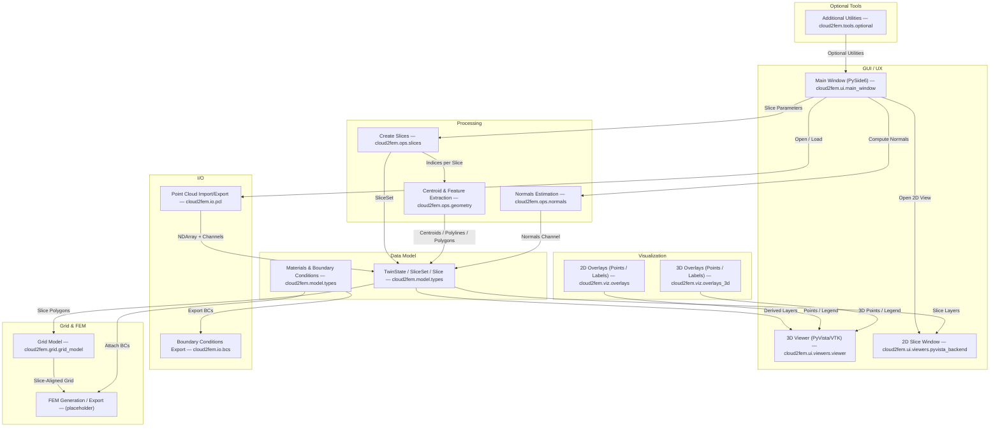

## Flowchart of main components

The following Mermaid flowchart illustrates the main components and data flow within the Cloud2FEMi application, covering GUI elements, data input/output, processing steps, data models, grid and FEM generation, visualization overlays, and optional tools.

