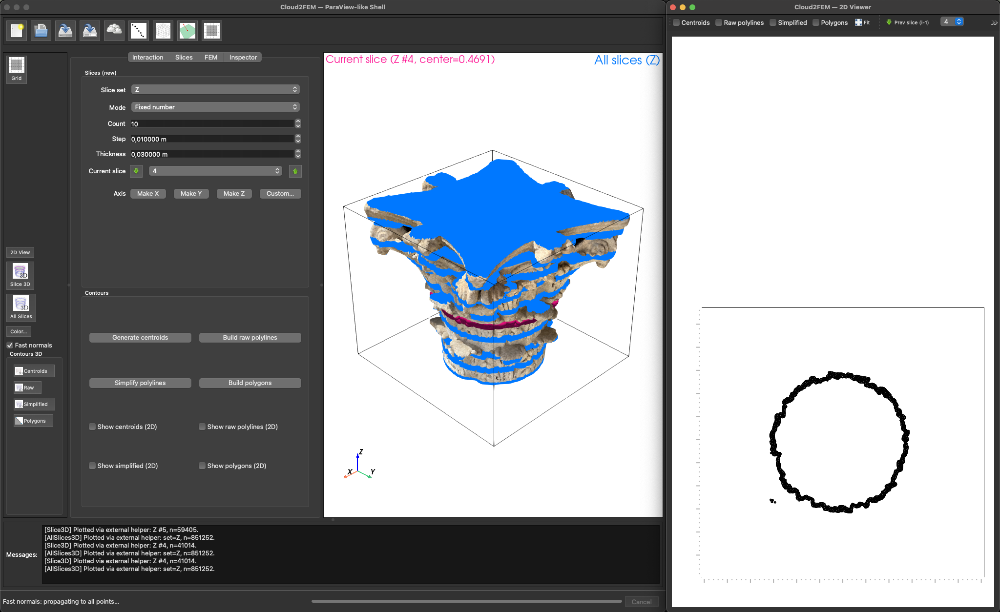

# Cloud2FEM Plugin

The **Cloud2FEM Plugin** converts point cloud slices into finite element meshes.

{ width=600 }

---

## Features

- Slicing point clouds along chosen axes.
- Centroid clustering and polyline extraction.
- Polygonization and mesh preparation.
- FEM export compatible with Julia Finetools.

---

## Usage

1. Load a point cloud dataset.
2. Open the **Slicing Panel** from the toolbar.
3. Adjust options:
   - Axis, thickness, spacing
   - In-plane filtering
   - Polygon simplification
4. Generate slices → review results in 2D/3D overlays.
5. Export to FEM input.

---

## Options

- **Slicing Modes**: fixed step, fixed count, custom.
- **Centroids**: tolerance parameters for wall thickness & clustering.
- **Visualization**: 3D overlay with points, centroids, and polygons.
- **Export**: save mesh to Finetools format.

---