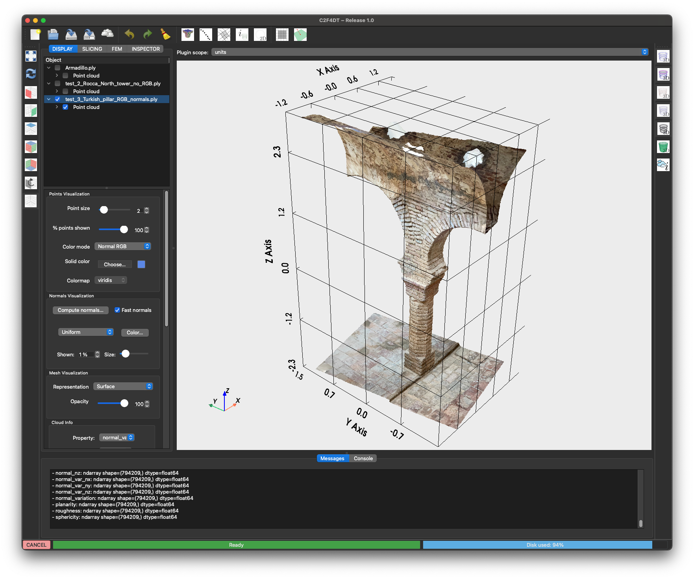
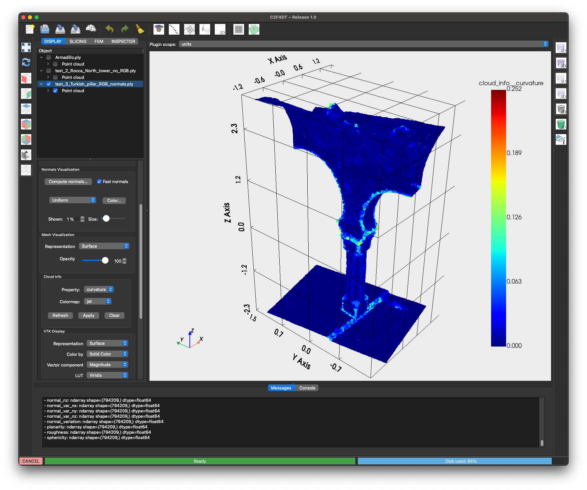
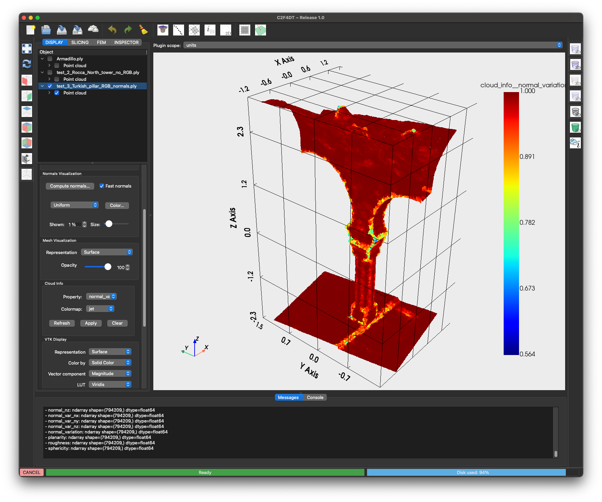

# Cloud Inspection Plugin

The **Cloud Inspection Plugin** computes descriptive metrics on loaded point clouds.

{ width=400 }
{ width=400 }

---

## Features

- Global metrics: point count, bounding box, mean NN distance, density.
- Structural detection: horizontal planes, clustering, edge indicators.
- Per-point properties: normals, curvature, roughness, planarity, linearity.
- Visualization through the **Cloud Info** panel (coloring by property with colormaps).
- Report window + export to dataset tree.

---

## Usage

1. Load a point cloud dataset.
2. Open the plugin from the toolbar button.
3. Select the metrics to compute and click **Compute**.
4. The results appear in:
   - **Dataset Tree** → Inspection branch  
   - **Message Window** → textual report  
   - **Cloud Info Panel** → property-based coloring  

---

## Options

- **Quick Test**: preview computation for one metric.
- **Dataset chooser**: when multiple clouds are loaded.
- **Color mapping**: viridis, plasma, magma, inferno, jet.
- **Copy report**: export results to clipboard.

---

{ width=800 }
