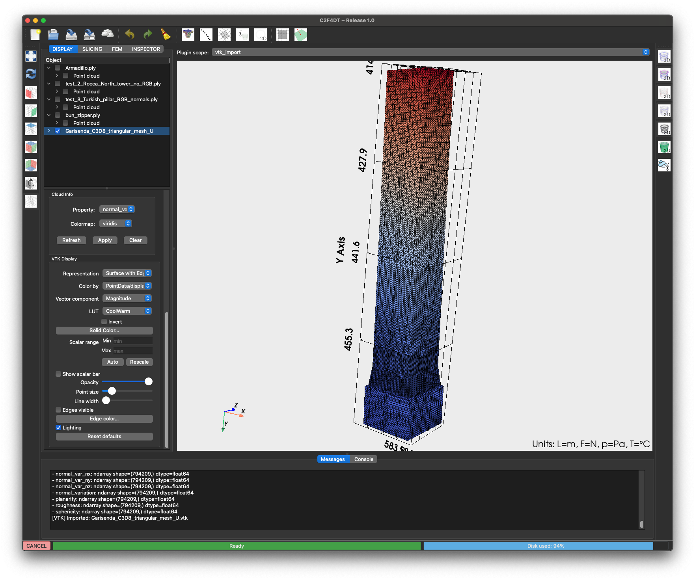

# Import VTK Plugin

The **Import VTK Plugin** loads datasets in VTK/VTU format directly into the viewer.

{ width=600 }

---

## Features

- Support for `.vtk` and `.vtu` files.
- Import point clouds, meshes, and unstructured grids.
- Automatic placement in the dataset tree.

---

## Usage

1. Click the toolbar button { width=24 }.
2. Select one or more VTK files.
3. The datasets appear in the **Tree Inspector**.
4. Visualize and interact with the data in 3D.

---

## Options

- **Multi-file import**: load several VTK datasets in one action.
- **Dataset labeling**: files are shown with their filename by default.
- **Compatibility**: works with PyVista and VTK formats.

---