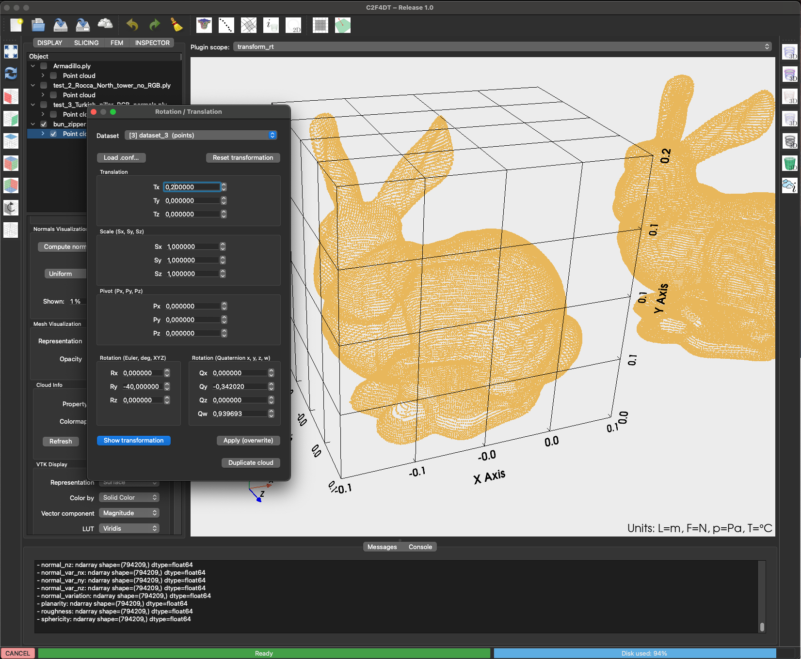

# Transformations Plugin

The **Transformations Plugin** applies geometric transformations to loaded datasets.

{ width=600 }

---

## Features

- Translate, rotate, and scale datasets interactively.
- Apply transformations to one or multiple datasets.
- Restore original position or reset transformations.

---

## Usage

1. Select a dataset in the tree.
2. Open the plugin from the toolbar.
3. Enter parameters for:
   - Translation (X, Y, Z)
   - Rotation (degrees around axis)
   - Scale (uniform or per-axis)
4. Press **Apply** to update the dataset in the viewer.

---

## Options

- **Incremental mode**: apply transformations relative to current state.
- **Reset**: restore to original coordinates.
- **Batch mode**: apply the same transformation to all selected datasets.

---