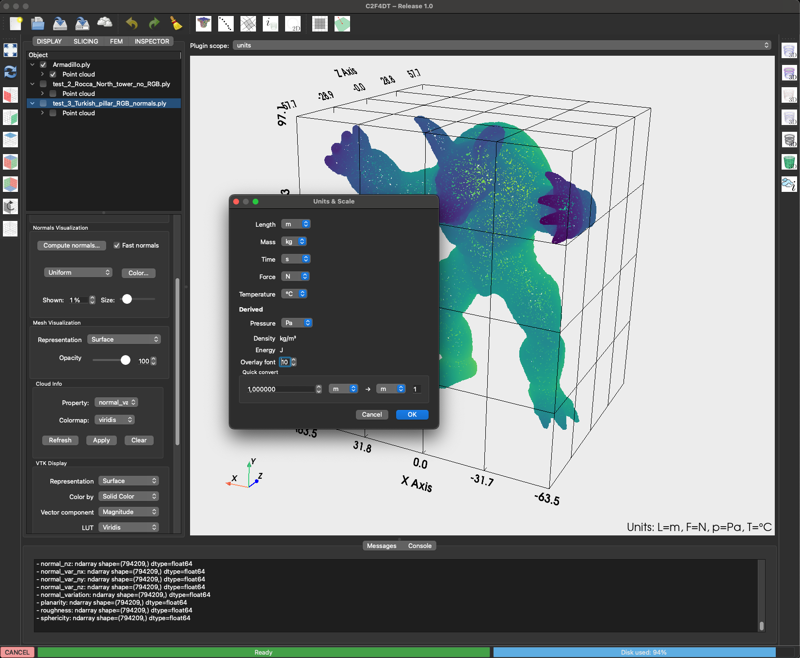

# Units Plugin

The **Units Plugin** provides conversion tools and reference tables for common engineering units.

{ width=600 }

---

## Features

- Quick conversion between SI and Imperial units.
- Reference values for typical structural materials.
- Inline use from the **right vertical toolbar**.

---

## Usage

1. Open the plugin via the toolbar button { width=24 }.
2. Select the source and target units.
3. Enter a value and press **Convert**.
4. Copy the converted value into your workflow.

---

## Options

- **Length** (m, cm, mm, in, ft)
- **Force** (N, kN, lb)
- **Stress** (Pa, MPa, psi)
- **Custom presets** can be added via `plugin.yaml`.

---