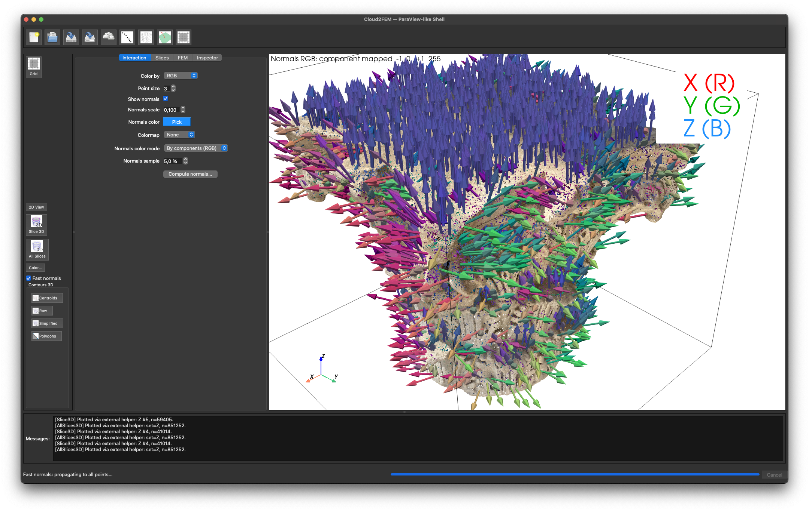
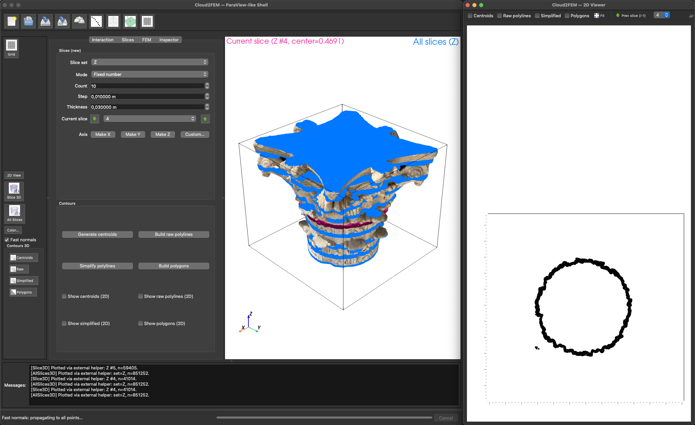

# Cloud2FEMi — Developer Guide

Welcome to the **Cloud2FEMi** developer documentation. This site collects guidelines, code architecture, theory, and an **auto-generated API reference**.




## About Cloud2FEMi

**Cloud2FEMi** is an open-source software tool designed to bridge the gap between 3D point cloud data and finite element method (FEM) models. It enables researchers and engineers to efficiently process point clouds obtained from various scanning technologies and convert them into high-quality FEM meshes for structural analysis and simulation. Developed in the context of structural health monitoring and civil engineering, Cloud2FEMi facilitates advanced modeling workflows by automating key steps from raw data to simulation-ready models.



## Features

- Import and preprocess 3D point clouds from multiple formats
- Slice point clouds into meaningful cross-sections
- Generate centroids and polygons to represent structural elements
- Create grids and finite element meshes for structural analysis
- Define boundary conditions (BCs) and load cases
- Visualize point clouds, meshes, and simulation results within the tool

## Publications

Cloud2FEMi and its underlying methodologies have been described and validated in several key publications:

- [Cloud2FEM: A finite element mesh generator based on point clouds of existing/historical structures](https://www.sciencedirect.com/science/article/pii/S235271102200067X). Castellazzi, G., et al. (2022). *SoftwareX*.
- [An innovative numerical modeling strategy for the structural analysis of historical monumental buildings](https://www.sciencedirect.com/science/article/pii/S0141029616312627). Castellazzi, G., et al. (2017). *Engineering Structures*.
- [From Laser Scanning to Finite Element Analysis of Complex Buildings by Using a Semi-Automatic Procedure](https://www.mdpi.com/1424-8220/15/8/18360). Castellazzi, G., et al. (2015). *Sensors*.

## Getting Started

To begin exploring Cloud2FEMi, we recommend reviewing the following sections:

- [Installation](guide/installation.md)
- [Overview](guide/overview.md)
- [Theory & Equations](guide/theory.md)
- [Architecture](guide/architecture.md)
- [Flowchart](guide/flowchart.md)

## Quick start
```bash
# Local preview
pip install mkdocs-material "mkdocstrings[python]" pymdown-extensions
mkdocs serve
```

## Goals
- Documentation that is easy to evolve during development (Markdown + MathJax)
- Always up-to-date Python API via **mkdocstrings**
- Automatic deploy to **GitHub Pages**
