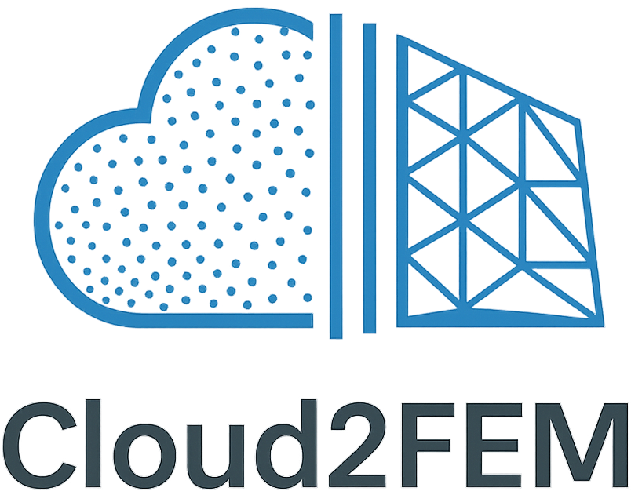
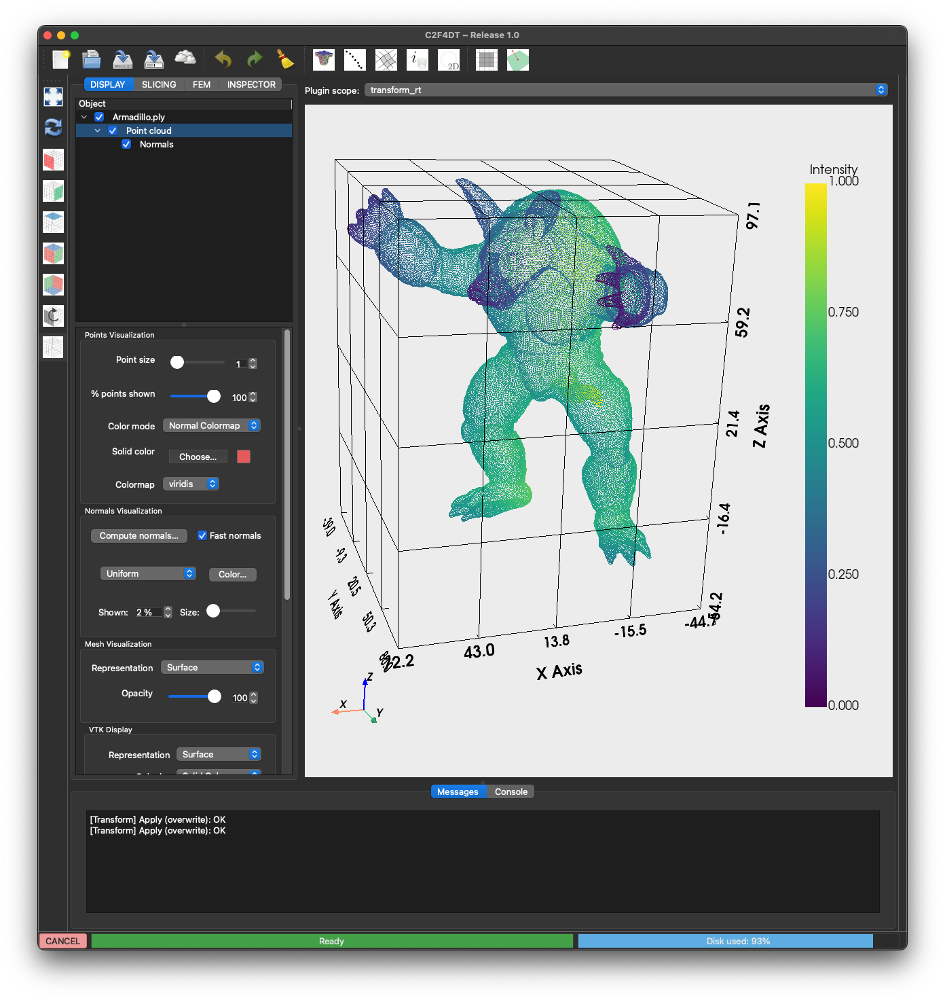
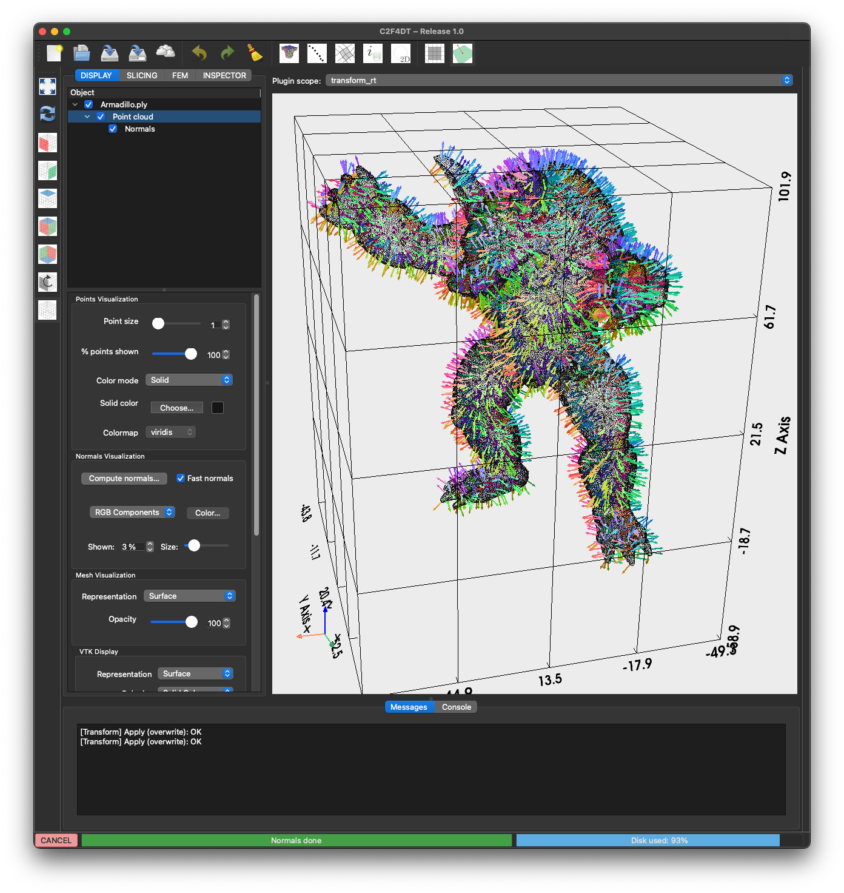

# C2F4DT — Developer Guide
 Welcome to the **C2F4DT** developer documentation. This site collects guidelines, code architecture, theory, and an **auto-generated API reference**.  

**C2F4DT** is a modular software package designed as a 3D viewer and interaction environment built on VTK. Its primary goal is to provide a framework where plugins can be developed to visualize and interact with point clouds and finite element models. Within this architecture, **Cloud2FEM** is included as one of the plugins, enabling users to transform point cloud data into finite element meshes.

The concept behind C2F4DT is to serve as a host for digital twins of finite element models that can be initialized or continuously updated using point cloud data or IoT (Internet of Things) streams. This first release focuses on the core viewer capabilities, establishing a foundation for visualization, interaction, and plugin integration.

Future versions will extend the package with additional plugins and extensions, enhancing functionality and enabling more advanced workflows for digital twin management and structural analysis.

## Features

- Import and preprocess 3D point clouds from multiple formats
- Slice point clouds into meaningful cross-sections
- Generate centroids and polygons to represent structural elements
- Create grids and finite element meshes for structural analysis
- Define boundary conditions (BCs) and load cases
- Visualize point clouds, meshes, and simulation results within the tool



## Publications

Cloud2FEMi and its underlying methodologies have been described and validated in several key publications:

- [Cloud2FEM: A finite element mesh generator based on point clouds of existing/historical structures](https://www.sciencedirect.com/science/article/pii/S235271102200067X). Castellazzi, G., et al. (2022). *SoftwareX*.
- [An innovative numerical modeling strategy for the structural analysis of historical monumental buildings](https://www.sciencedirect.com/science/article/pii/S0141029616312627). Castellazzi, G., et al. (2017). *Engineering Structures*.
- [From Laser Scanning to Finite Element Analysis of Complex Buildings by Using a Semi-Automatic Procedure](https://www.mdpi.com/1424-8220/15/8/18360). Castellazzi, G., et al. (2015). *Sensors*.

## Getting Started

To begin exploring C2F4DT, we recommend reviewing the following sections:

- [Overview](guide/overview.md) 
- [Installation](guide/installation.md) 
- [Console Guide](guide/console_guide.md) 
- [Architecture](guide/architecture.md) 
- [Flowchart](guide/flowchart.md) 

## Quick start

To get started with the Cloud2FEM for Digital Twins framework, follow these steps:

- Step 1: Create a virtual environment to isolate dependencies
```bash
python -m venv .venv_c2f4dt
```

- Step 2: Activate the virtual environment (On Windows, use: .venv_c2f4dt\Scripts\activate)
```bash
source .venv_c2f4dt/bin/activate  
```

- Step 3: Install the required dependencies from the requirements file
```bash
pip install -r requirements.txt
```

- Step 4: Install the current package in editable mode for development purposes
```bash
pip install -e .
```

- Step 5: Run the main script to start the application
```bash
python main.py
```



